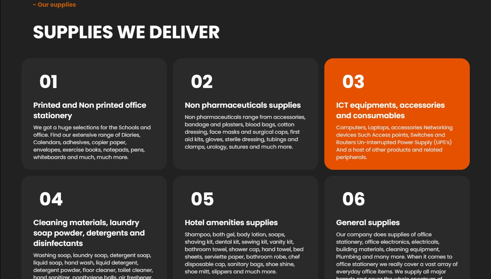

# Gevic Mundare

Gevic mundare is a web application that aims to simplify procurement services. You are able to view the items ordered, check delivery timelines, view your invoices as well as launch complaints incase of any issues. This is meant to make procurement as open as possible. Still under development an alot more features are coming ahead. 

### Issues

 ### Technologies used
 - React 18
 - Firebase
 - Tailwind CSS
 - Material Tailwind

 ### Screenshots

 
 
 
 

 ### Author
 
 ##### Gamaliel Sirengo
 - <a href='https://t.me/sirgama' >Telegram</a>
  - <a href='https://twitter.com/sirgama_' >Twitter</a>